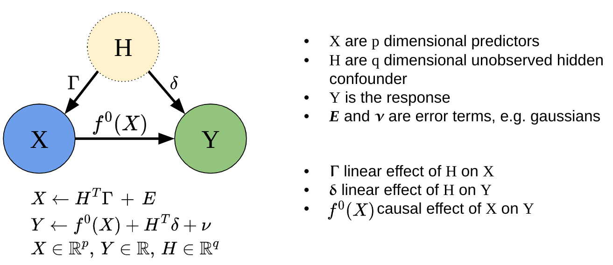
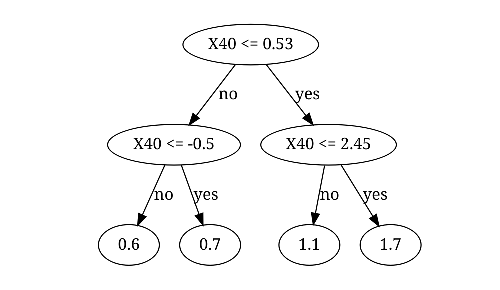

<!-- README.md is generated from README.Rmd. Please edit that file -->

# SDForest

<!-- badges: start -->

[](https://github.com/markusul/SDForest/actions/workflows/R-CMD-check.yaml)
<!-- badges: end -->

Spectral Deconfounded Random Forests (SDForest) is a method for
estimating non-linear sparse causal effects in the presence of
unobserved confounding. SDForest has been shown to be a nice estimate
for the true causal function in such settings, if we observe many
covariates, e.g. high-dimensional setting, and we have fairly sparse
confounding. (**Ulmer?**), (Guo, Ćevid, and Bühlmann 2022), (Ćevid,
Bühlmann, and Meinshausen 2020)



## Installation

You can install the development version of SDForest from
[GitHub](https://github.com/) with:

``` r
# install.packages("devtools")
devtools::install_github("markusul/SDForest")
```

## Usage

This is a basic example on how to estimate the causal effect of $X$ on
$Y$ using SDForest. You can learn more about analyzing sparse causal
effects estimated by SDForest in `vignette("SDForest")`.

``` r
library(SDForest)

set.seed(42)
# simulation of confounded data
sim_data <- simulate_data_nonlinear(q = 2, p = 50, n = 100, m = 2)
X <- sim_data$X
Y <- sim_data$Y
train_data <- data.frame(X, Y)
# causal parents
sim_data$j
#> [1] 16 40
```

``` r

fit <- SDForest(Y ~ ., train_data)
fit
#> SDForest result
#> 
#> Number of trees:  100 
#> Number of covariates:  50 
#> OOB loss:  0.06 
#> OOB spectral loss:  0.03
```

You can also estimate just one Spectral Deconfounded Regression Tree
using the `SDTree` function. See also `vignette("SDTree")`.

``` r
causal_Tree <- SDTree(Y ~ ., train_data, cp = 0.03)

# plot the causal tree
causal_Tree
#>   levelName     value          s  j       label decision n_samples
#> 1 1         0.8398920  0.5322484 40 X40 <= 0.53                100
#> 2  ¦--1     0.6672222 -0.4974688 40 X40 <= -0.5       no        73
#> 3  ¦   ¦--1 0.5876494         NA NA         0.6       no        44
#> 4  ¦   °--4 0.7491725         NA NA         0.7      yes        29
#> 5  °--2     1.1482966  2.4494222 40 X40 <= 2.45      yes        27
#> 6      ¦--2 1.0937407         NA NA         1.1       no        21
#> 7      °--3 1.6619968         NA NA         1.7      yes         6
```

``` r
plot(causal_Tree)
```



<div id="refs" class="references csl-bib-body hanging-indent">

<div id="ref-Cevid2020SpectralModels" class="csl-entry">

Ćevid, Domagoj, Peter Bühlmann, and Nicolai Meinshausen. 2020. “<span
class="nocase">Spectral Deconfounding via Perturbed Sparse Linear
Models</span>.” *J. Mach. Learn. Res.* 21 (1).

</div>

<div id="ref-Guo2022DoublyConfounding" class="csl-entry">

Guo, Zijian, Domagoj Ćevid, and Peter Bühlmann. 2022. “<span
class="nocase">Doubly debiased lasso: High-dimensional inference under
hidden confounding</span>.” *The Annals of Statistics* 50 (3).
<https://doi.org/10.1214/21-AOS2152>.

</div>

</div>
