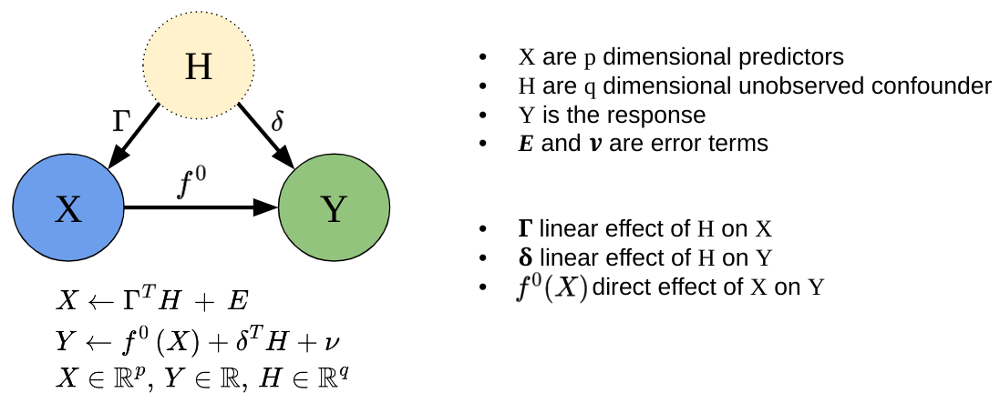

<!-- README.md is generated from README.Rmd. Please edit that file -->

# SDForest

<!-- badges: start -->

[](https://github.com/markusul/SDForest/actions/workflows/R-CMD-check.yaml)
<!-- badges: end -->

Spectral Deconfounded Random Forests (SDForest) is a method for
estimating non-linear sparse causal effects in the presence of
unobserved confounding. SDForest has been shown to be a nice estimate
for the true causal function in such settings, if we observe many
covariates, e.g. high-dimensional setting, and we have fairly sparse
confounding. <span style="color:red">Referenzen SDForest, DDL</span>



## Installation

You can install the development version of SDForest from
[GitHub](https://github.com/) with:

``` r
# install.packages("devtools")
devtools::install_github("markusul/SDForest")
```

## Usage

This is a basic example on how to estimate the causal effect of $X$ on
$Y$ using SDForest. You can learn more about analyzing sparse causal
effects estimated by SDForest in `vignette("SDForest")`.

``` r
library(SDForest)

set.seed(42)
# simulation of confounded data
sim_data <- simulate_data_nonlinear(q = 2, p = 50, n = 100, m = 2)
X <- sim_data$X
Y <- sim_data$Y
train_data <- data.frame(X, Y)
# causal parents
sim_data$j
#> [1]  1 47

fit <- SDForest(Y ~ ., train_data)
fit
#> SDForest result
#> 
#> Number of trees:  100 
#> Number of covariates:  50 
#> OOB loss:  0.25 
#> OOB spectral loss:  0.15
```

You can also estimate just one Spectral Deconfounded Regression Tree
using the `SDTree` function.

``` r
causal_Tree <- SDTree(Y ~ ., train_data, cp = 0.03)

# plot the causal tree
causal_Tree
#>        levelName     value           s  j        label decision n_samples
#> 1  1             1.3487531  0.04517764 47  X47 <= 0.05                100
#> 2   ¦--1         0.9499773 -1.69331644 47 X47 <= -1.69       no        50
#> 3   ¦   ¦--1     0.3489319          NA NA          0.3       no         7
#> 4   ¦   °--3     0.9859657 -0.04564622 12 X12 <= -0.05      yes        43
#> 5   ¦       ¦--3 0.7622188          NA NA          0.8       no        23
#> 6   ¦       °--6 1.2424454          NA NA          1.2      yes        20
#> 7   °--2         1.7391441 -3.55015330 27 X27 <= -3.55      yes        50
#> 8       ¦--2     1.2038948          NA NA          1.2       no         5
#> 9       °--4     1.7789876 -0.46335890  1  X1 <= -0.46      yes        45
#> 10          ¦--4 1.3813340          NA NA          1.4       no        17
#> 11          °--5 2.0542768          NA NA          2.1      yes        28
plot(causal_Tree)
```


