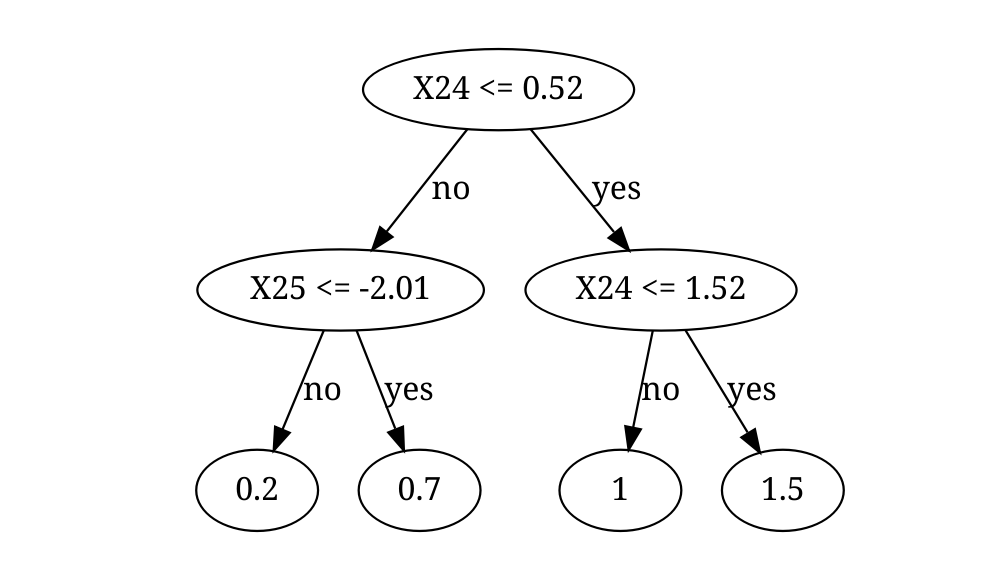

<!-- README.md is generated from README.Rmd. Please edit that file -->

# SDForest

<!-- badges: start -->

[](https://github.com/markusul/SDForest/actions/workflows/R-CMD-check.yaml)
<!-- badges: end -->

Spectrally Deconfounded Random Forests (SDForest) is a method for
estimating non-linear sparse direct effects in the presence of
unobserved confounding. SDForest has shown to be a good estimate for the
true direct effect, if we observe many covariates, e.g. high-dimensional
setting, and we have fairly dense confounding ((**Ulmer?**), Guo, Ćevid,
and Bühlmann (2022), Ćevid, Bühlmann, and Meinshausen (2020)). Even if
the assumptions are violated, there is not much to lose and SDForest
will, in general, estimate a function closer to $f^0$ than classical
Random Forests.


## Installation

You can install the development version of SDForest from
[GitHub](https://github.com/) with:

``` r
# install.packages("devtools")
devtools::install_github("markusul/SDForest")

# or
# install.packages('pak')
# pak::pkg_install('markusul/SDForest')
```

## Usage

This is a basic example on how to estimate the direct effect of $X$ on
$Y$ using SDForest. You can learn more about analyzing sparse direct
effects estimated by SDForest in `vignette("SDForest")`.

``` r
library(SDForest)

set.seed(42)
# simulation of confounded data
sim_data <- simulate_data_nonlinear(q = 2, p = 50, n = 100, m = 2)
X <- sim_data$X
Y <- sim_data$Y
train_data <- data.frame(X, Y)
# parents
sim_data$j
#> [1] 25 24

fit <- SDForest(Y ~ ., train_data)
fit
#> SDForest result
#> 
#> Number of trees:  100 
#> Number of covariates:  50 
#> OOB loss:  0.16 
#> OOB spectral loss:  0.05
```

You can also estimate just one Spectrally Deconfounded Regression Tree
using the `SDTree` function. See also `vignette("SDTree")`.

``` r
Tree <- SDTree(Y ~ ., train_data, cp = 0.03)

# plot the tree
Tree
#>   levelName     value          s  j        label decision n_samples
#> 1 1         0.8295434  0.5186858 24  X24 <= 0.52                100
#> 2  ¦--1     0.6425567 -2.0062213 25 X25 <= -2.01       no        63
#> 3  ¦   ¦--1 0.1525245         NA NA          0.2       no         9
#> 4  ¦   °--3 0.6613778         NA NA          0.7      yes        54
#> 5  °--2     1.1811389  1.5229617 24  X24 <= 1.52      yes        37
#> 6      ¦--2 1.0361679         NA NA            1       no        19
#> 7      °--4 1.4544461         NA NA          1.5      yes        18
plot(Tree)
```



<div id="refs" class="references csl-bib-body hanging-indent">

<div id="ref-Cevid2020SpectralModels" class="csl-entry">

Ćevid, Domagoj, Peter Bühlmann, and Nicolai Meinshausen. 2020.
“<span class="nocase">Spectral Deconfounding via Perturbed Sparse Linear
Models</span>.” *J. Mach. Learn. Res.* 21 (1).

</div>

<div id="ref-Guo2022DoublyConfounding" class="csl-entry">

Guo, Zijian, Domagoj Ćevid, and Peter Bühlmann. 2022.
“<span class="nocase">Doubly debiased lasso: High-dimensional inference
under hidden confounding</span>.” *The Annals of Statistics* 50 (3).
<https://doi.org/10.1214/21-AOS2152>.

</div>

</div>
