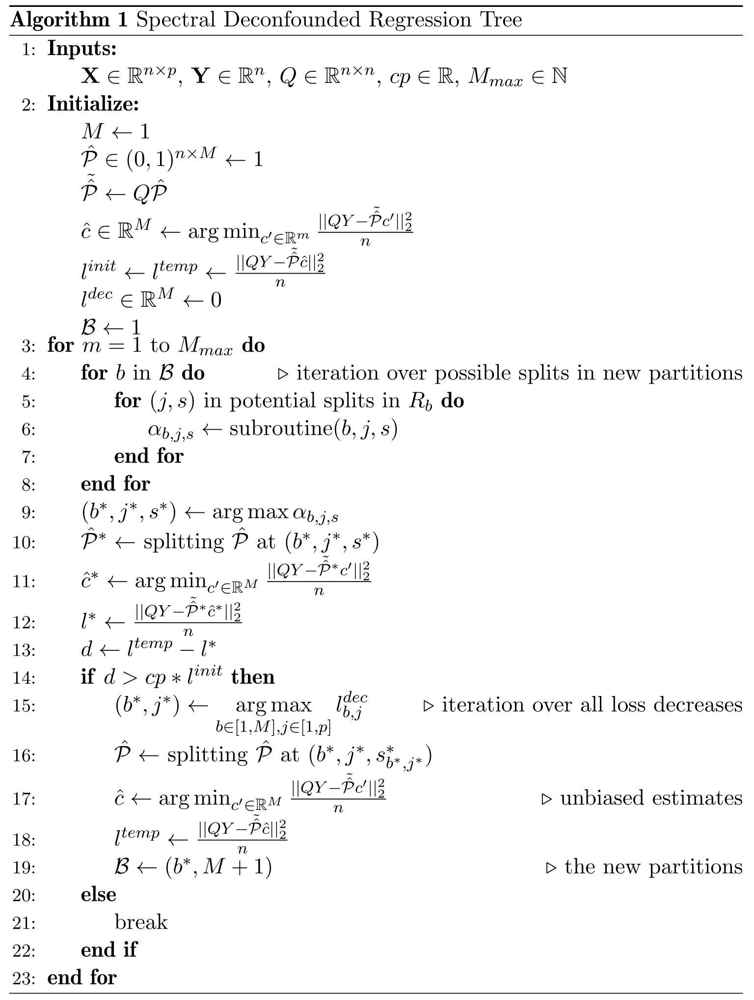

```{r, include = FALSE}
knitr::opts_chunk$set(
  collapse = TRUE,
  comment = "#>"
)
```

A regression tree is part of the function class of step functions $f(X) = \sum_{m = 1}^M 1_{\{X \in R_m\}} c_m$, where ($R_m$) with $m = 1, \ldots, M$ are regions dividing the space $\mathbb{R}^p$ into $M$ rectangular parts. Each region has response level $c_m \in \mathbb{R}$. For the training data, we can write the step function as $f(\mathbf{X}) = \mathcal{P} c$ where $\mathcal{P} \in \{0, 1\}^{n \times M}$ is an indicator matrix encoding to which region an observation belongs to and $c \in \mathbb{R}^M$ is a vector containing the levels corresponding to the different regions. An observation can only belong to one region meaning only one entry per row in $\mathcal{P}$ can be 1: $\text{rowSums}(\mathcal{P}) = 1$.


This goal is to find

$$(\hat{\mathcal{P}}, \hat{c}) = \text{argmin}_{\substack{\mathcal{P}' \in \{0, 1\}^{n \times M}, \ c' \in \mathbb{R}^ {M} \\ \text{rowSums}(\mathcal{P'}) = 1}} \frac{||Q(\mathbf{Y} - \mathcal{P'} c')||_2^2}{n}$$
where $Q$ is a spectral transformation (@Guo2022DoublyConfounding, @Cevid2020SpectralModels).

Since it is unfeasible to iterate over all possible partitions $\mathcal{P}$, we try to find a reasonable $\hat{\mathcal{P}}$ by using the tree structure and repeated splitting of the leaves, similar to the original cart algorithm [@Breiman2017ClassificationTrees]. Since comparing all possibilities for $\mathcal{P}$ is impossible, we let a tree grow greedily. Given the current tree, we iterate over all leaves and all possible splits. We choose the one that reduces the spectral loss the most, using the SDTree subroutine, and estimate after each split all the leave estimates $\hat{c} = \text{argmin}_{c' \in \mathbb{R}^M} \frac{||Q\mathbf{Y} - Q\mathcal{P} c'||_2^2}{n}$ which is just a linear regression problem. This is repeated until the loss decreases less than a minimum loss decrease after a split. The minimum loss decrease equals a cost-complexity parameter $cp$ times the initial loss when only an overall mean is estimated. The cost-complexity parameter $cp$ controls the complexity of a regression tree and acts as a regularization parameter.



### SDTree subroutine

In lines 4-7 of the algorithm, one seeks to find the split $(b, j, s)$ among the candidate splits that lead to the largest decrease $\alpha_{b, j, s}$ of the spectral objective $\|Q(\mathbf Y - \mathcal P \hat c)\|$. Naively, for every candidate split, one would update the indicator matrix $\mathcal P$, calculate the corresponding least squares estimator $\hat c$ and plug it in to obtain the loss decrease. Using the following procedure, the decrease in loss can be calculated more efficiently.

To initialize, set $u_1' = Q\cdot (1,\ldots, 1)^T$ and $u_1 = u_1'/\|u_1'\|$. Inductively, assume now that we are at step $M$ of the for loop on line 3 of the algorithm and have defined vectors $u_1, \ldots, u_M\in \mathbb R^n$. At this step, we evaluate new potential splits parameterized by $(b, j, s)$ (see lines 4-6 of the algorithm). The new splits can be encoded by a vector $e = e^{(b, j,s)}\in \{0,1\}^n$ with the set $\{j\in \{1,\ldots, n\}: e_j = 1\}$ being a subset of the set $\{j\in \{1,\ldots, n\}: \hat {\mathcal P}_{j, m}\}$ for some $m\in \{1, \ldots, M\}$. For a candidate split encoded by $e$, define $u'(e) = (Q-\sum_{l=1}^M u_l u_l^T Q)e$ and $\alpha(e) = (u'(e)^T QY)^2/\|u'(e)\|_2^2.$
Then, $\alpha_{b, j, s}$ according to line 6 of the algorithm is defined by $\alpha_{b, j, s} := \alpha(e^{(b, j, s)})$. Finally, define $u_{M+1} = u'(e^{(b^*, j^*, s^*)})/\|u'(e^{(b^*, j^*, s^*)})\|_2$ with $(b^*, j^*, s^*)$ defined in line 9 of the algorithm.

### SDForest

The spectral deconfounded Random Forest combines SDTrees in the same way, as in the original Random Forest [@Breiman2001RandomForests]. The idea is to combine multiple regression trees into an ensemble in order to decrease variance and get a smooth function. Ensembles work best if the different models are independent of each other. To decorrelate the regression trees as much as possible from each other, we have two mechanisms. The first one is bagging [@Breiman1996BaggingPredictors], where we train each regression tree on an independent bootstrap sample of the observations, e.g., we draw a random sample of size $n$ with replacement from the observations. The second mechanic to decrease the correlation is that only a random subset of the covariates is available for each split. Before each split, we sample $\text{mtry} \leq p$ from all the covariates and choose the one that reduces the loss the most only from those. 

$$\widehat{f(X)} = \frac{1}{N_{tree}} \sum_{t = 1}^{N_{tree}} SDTree_t(X^{boot})$$